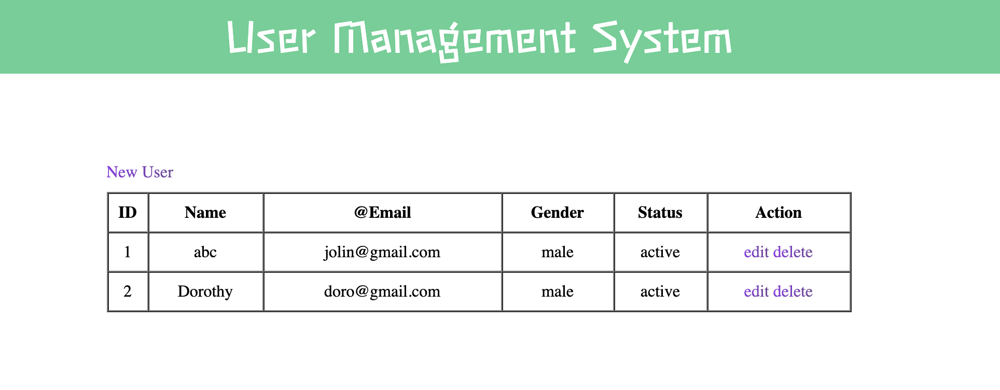

# User Management App

## About the App:

This app is designed to organize and record users personal information. Such as name 
email address, gender etc.

## App Link:

(https://ga-p2usermanagementweb.herokuapp.com/)

## Technologies Used:

-   **Express** 
-   **Express-session** 
-   **MongoDB** 
-   **EJS** 
-   **Dotenv** i
-   **Skeleton** 

## Database:

-   **MongoDB** 
MongoDB is a source-available cross-platform document-oriented database program. Classified as a NoSQL database program, MongoDB uses JSON-like documents with optional schemas. MongoDB is developed by MongoDB Inc. and licensed under the Server Side Public License

## Objective:

-   Make a full CRUD (Create, Read, Update and Delete) using Node.js, MongoDB, Express and EJS that adheres to MVC (Models, Views, and Controllers) file structure

## Steps:

-   Design the frame of the app, identify the required functions
-   Set up basic MVC structure with basic CRUD routes
-   CSS designs
-   Set up database in MongoDB
-   Test app functions
-   Link app to Heroku

## Wireframe:

-   Index.html Page
    

## RESTful Routes:

| No. | Route   | URL               | HTTP Verb | Description                                                                      |
| --- | ------- | ----------------- | --------- | -------------------------------------------------------------------------------- |
| 1.  | Index   | /                 | GET       | Main App Landing Page                                                            |
|     |         | /app              | GET       | App Dashboard                                                                    |
| 2.  | New     | /sessions/new     | GET       | Log In Form                                                                      |
|     |         | /users/new        | GET       | Sign Up Form                                                                     |
|     |         | /app/new          | GET       | Add New Show Form                                                                |
| 3.  | Create  | /sessions         | POST      | Authenticates credentials against database and redirect to Main App Landing Page |
|     |         | /users            | POST      | Records new user into database and redirect to Main App Landing Page             |
|     |         | /app              | POST      | Creates new show and redirect to App Dashboard                                   |
| 4.  | Show    | /app/:showID      | GET       | Displays requested show                                                          |
| 5.  | Edit    | /app/:showID/edit | GET       | Edit Show Form that reflects current show data in form                           |
| 6.  | Update  | /app/:showID      | PUT       | Updates requested show and redirects to requested show page                      |
| 7.  | Destroy | /sessions         | DELETE    | Destroys session and redirect to Main App Landing Page                           |
|     |         | /app/:showID      | DELETE    | Deletes requested show in database and redirects to App Dasboard                 |

## Accomplishments:

-   The app meets the Minimum Viable Product's (MVP) requirements

## Challenges:

-   To design the whole frame of the project, and make it become real one by one still lack of practice.

## Further Improvements:

-   More models 
-   login system
-   Profile image uploading to recongize the user. 